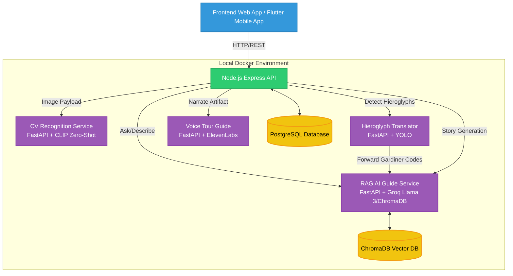

# KHEMET - Grand Egyptian Museum Tourist Guide

[](https://nodejs.org/)
[](https://www.python.org/)
[](https://fastapi.tiangolo.com/)
[](https://reactjs.org/)
[](https://www.docker.com/)
[](https://opensource.org/licenses/MIT)


**KHEMET** is a comprehensive, AI-powered full-stack museum guide platform designed to provide tourists and museum visitors with an intelligent digital assistant for exploring ancient Egyptian monuments and artifacts at the Grand Egyptian Museum. 

By combining state-of-the-art **Computer Vision**, **Retrieval-Augmented Generation (RAG)**, **Multilingual RESTful APIs**, and a scalable **Microservices Architecture**, KHEMET delivers an immersive and interactive user experience bridging ancient history with modern technology.

---

## 📑 Table of Contents

- [Core Features](#core-features)
- [System Architecture & Workflow](#system-architecture--workflow)
- [Technology Stack](#technology-stack)
- [Project Structure](#project-structure)
- [Detailed Component Breakdown](#detailed-component-breakdown)
- [Advanced Methodologies](#advanced-methodologies)
- [Database Schema](#database-schema)
- [Setup & Installation](#setup--installation)
  - [Environment Variables](#environment-variables)
  - [Docker Quick Start](#docker-quick-start)
- [API Documentation](#api-documentation)
- [Future Roadmap](#future-roadmap)
- [Contributing](#contributing)
- [License & Acknowledgments](#license--acknowledgments)

---

## ✨ Core Features

- 📸 **AI Artifact Recognition:** Upload or capture an image of an artifact. The platform uses a highly trained deep learning model to recognize the artifact, returning its identity, historical context, and a confidence score.
- 🤖 **AI Historical Guide (RAG):** Ask historical questions in a chat-like interface. The AI accesses a local vector database (ChromaDB) filled with verified Egyptian history to provide accurate, hallucination-free answers.
- 🎙️ **Voice Tour Guide:** AI-generated audio narrations for artifacts using ElevenLabs multilingual TTS (English, Arabic). Narrations are generated once and cached in PostgreSQL per artifact per language. Routed securely through the Node.js backend with rate limiting.
- 🪶 **Hieroglyph Translation:** A dedicated YOLO-based microservice detects Egyptian hieroglyphs (Gardiner codes) and translates them into English sequentially.
- 🌍 **Multilingual Support:** The platform supports multiple languages (English, Arabic, Spanish, French, German, Chinese, Russian) dynamically served from the database to accommodate global tourists.
- 👤 **User Ecosystem:** A fully-featured user management system where users can register, maintain profiles, save artifacts to their personal gallery, access their scan history, and leave reviews for monuments.
- 🔒 **Secure Platform:** Fully protected backend routes with JWT authentication, refresh token workflows, OTP for password resets, and robust payload validation.

---

## 🏗️ System Architecture & Workflow

The KHEMET project employs a service-oriented **Microservices Architecture**, orchestrated seamlessly using Docker Compose. All services communicate over an isolated internal Docker bridge network.



### The Request Lifecycle:
1. **User Interaction:** The user interacts with the React web app and captures an image of the "Mask of Tutankhamun".
2. **Backend Gateway:** The image is sent to the Node.js backend (`/api/scan/artifact`) via a multipart, JWT-authenticated request.
3. **AI Inference:** The backend routes the image to the `CV_Recognition` microservice. The model identifies the artifact.
4. **Context Augmentation:** The backend requests a dynamic historical summary of the identified artifact from the `chatbot_LLM`.
5. **Persistence:** The session is mapped to a localized Monument ID in PostgreSQL and saved to the user's scan history.
6. **Result Delivery:** The enriched payload is returned and beautifully rendered on the user's screen.

---

## 🛠️ Technology Stack

### Frontend Client
- **Framework:** React + Vite
- **Styling:** Tailwind CSS, PostCSS, Framer Motion
- **State Management:** TanStack React Query, Context API
- **Routing:** React Router DOM
- **Network:** Axios
- **i18n:** react-i18next

### Backend Gateway
- **Runtime:** Node.js
- **Framework:** Express.js
- **Database:** PostgreSQL
- **ORM:** Sequelize
- **Security:** JWT Authentication, bcrypt hashing
- **File Handling:** Multer

### AI Microservices
- **Frameworks:** Python 3.10, FastAPI, Uvicorn
- **Computer Vision:** TensorFlow (Keras Primary Model), PyTorch (CLIP Zero-Shot Fallback)
- **Object Detection:** YOLOv11 (Hieroglyph bounding boxes)
- **LLM & RAG Engine:** 
  - Llama 3.3 70B (via Groq API Integration for lightning-fast inference)
  - `Qwen/Qwen3-Embedding-0.6B` Dense Embeddings (runs on GPU/CPU)
  - `BAAI/bge-reranker-base` Cross-Encoder Reranker
  - ChromaDB (Vector Database)
  - Sentence Transformers
  - HuggingFace Ecosystem

### DevOps & Infrastructure
- **Containerization:** Docker
- **Orchestration:** Docker Compose
- **GPU Acceleration:** NVIDIA driver capabilities mapped for deep learning containers.

---

## 📁 Project Structure

```text
Khemet/
├── .env                        # Root environment configuration
├── docker-compose.yml          # Orchestrates all services (DB, Backend, AI)
│
├── backend/                    # Node.js API Gateway
│   ├── backend/                # Express application source code
│   └── (Controllers, Routes, Sequelize Models, Seeders)
│
├── AI_services/                # Machine Learning Microservices
│   ├── CV_Recognition/         # Image Classification Service (Port 8000)
│   ├── chatbot_LLM/            # RAG Engine & LLM Integration (Port 8001)
│   ├── hieroglyph_translator/  # YOLO Detection Pipeline (Port 8002)
│   └── voice_tour_guide/       # ElevenLabs TTS Narration (Port 8003, internal)
│
└── web-frontend/               # React / Vite Client Application
    ├── src/                    # Source code (Components, Pages, API layers)
    └── public/                 # Static assets
```

---

## 🔍 Detailed Component Breakdown

### A. The Backend API Gateway (`backend/`)
Serves as the single source of truth. No client application directly communicates with the AI services, ensuring robust security, rate-limiting, and data integrity.
- **Entity Management:** CRUD for Monuments, Users, Galleries, Reviews.
- **Service Proxying:** Safely routes image payloads and prompt data to the internal AI network.

### B. CV Recognition Service (`AI_services/CV_Recognition/`)
Accepts image files (`POST /predict`) and classifies them against 70+ distinct classes of Egyptian artifacts (e.g., `Mask_of_Tutankhamun`). Built on a dual architecture: a primary TensorFlow Keras model, and a HuggingFace CLIP zero-shot fallback to ensure high-accuracy recognition even on low-confidence predictions.

### C. Chatbot LLM & RAG Service (`AI_services/chatbot_LLM/`)
The brain of text generation. 
- **Retrieval:** Uses `SentenceTransformers` to embed queries, searching `ChromaDB` for accurate historical text chunks.
- **Generation:** Feeds the context to an LLM to generate factual, hallucination-free answers.

### D. Hieroglyph Translator Service (`AI_services/hieroglyph_translator/`)
- **Stage 1 (Detection & Sorting):** YOLOv11 detects bounding boxes of Gardiner codes. It deduplicates overlapping predictions (keeping the highest confidence) and spatially sorts them into proper reading order (LTR or RTL).
- **Stage 2 (Knowledge Base Mapping):** The codes are cross-referenced with a comprehensive `gardiner_master.json` dataset to extract raw English meanings, Unicode characters, and phonetics.
- **Stage 3 (LLM Refinement):** The rich context is processed by the LLM (via the `chatbot_LLM` service), which analyzes the sequence to identify Royal Titles, Deity Names, or Common Phrases, outputting a highly structured JSON translation including cultural context and transliterations.

---

## 🧠 Advanced Methodologies

1. **Retrieval-Augmented Generation (RAG):**
   Prevents LLM hallucination by embedding reliable historical texts into a Vector DB, retrieving only verified paragraphs when answering questions.
2. **Model Decoupling & Volume Mounting:**
   To maintain lightweight Docker images, massive machine learning weights (`.h5`, `.pt`) and HuggingFace caches are mounted externally via Docker volumes at runtime.
3. **Internal Docker DNS:**
   Services communicate via Docker bridge networks (`http://cv-recognition:8000`) rather than exposing public ports, fortifying architecture security.

---

## 📊 Database Schema

The central PostgreSQL database leverages Sequelize ORM with the following core models:
- **`Users`**: Credentials, JWT refresh tokens, language preferences.
- **`Monuments`**: Base artifact metadata (coordinates, eras, discovery info).
- **`Monument_Translations`**: Localized titles and descriptions for multi-language UI support.
- **`Scan_Sessions`**: Logs historical CV model queries mapped directly to user accounts.
- **`Reviews` / `Gallery_Items`**: Relational tables for user-generated content.

---

## 🚀 Setup & Installation

### Prerequisites
- [Docker](https://docs.docker.com/get-docker/) & [Docker Compose](https://docs.docker.com/compose/install/)
- Node.js (for local non-docker UI testing)
- Python 3.10+ (for local model testing)

### Environment Variables
Copy `.env.example` to `.env` in the root and configure:
```env
# Database Config
DB_HOST=postgres
DB_USER=postgres
DB_PASS=1234
DB_NAME=gem_museum

# Backend Secrets
JWT_SECRET=your_super_secret_jwt_key
PORT=3000

# AI APIs
GROQ_API_KEY=your_groq_api_key_here
ELEVENLABS_API_KEY=your_key_here
ELEVENLABS_VOICE_EN=your_english_voice_id
ELEVENLABS_VOICE_AR=your_arabic_voice_id

# Backend service URLs (Docker internal)
AI_SERVICE_URL=http://cv-recognition:8000
RAG_SERVICE_URL=http://chatbot-llm:8001
HIEROGLYPH_SERVICE_URL=http://hieroglyph-translator:8002
VOICE_SERVICE_URL=http://voice-tour-guide:8003
```

### Docker Quick Start

1. Ensure large model files are placed in their respective directories:
   - `hieroglyph_translator/model/best_V2.pt` (YOLOv11 weights)
   - CLIP and Qwen3 model weights are downloaded automatically from HuggingFace at first run.
2. Spin up the entire infrastructure:
   ```bash
   docker-compose up --build -d
   ```
3. After first run or after resetting volumes, seed the database:
   ```bash
   docker compose exec backend npm run seed
   ```
   > **⚠️ Warning:** If `docker compose down -v` is used, the database and monument images are wiped. You must re-run this seed script to restore them, otherwise the collections page will show broken images.
4. Access the platforms:
   - **React Frontend:** `http://localhost:5173`
   - **Node.js Backend:** `http://localhost:3000`
   - **FastAPI Swagger Docs:** `http://localhost:8000/docs` (CV), `http://localhost:8001/docs` (LLM)

---

## 📖 API Documentation

Once the backend and AI services are running, interactive API documentation is available:
- **CV Recognition Swagger:** [http://localhost:8000/docs](http://localhost:8000/docs)
- **Chatbot LLM Swagger:** [http://localhost:8001/docs](http://localhost:8001/docs)
- **Hieroglyph Translator Swagger:** [http://localhost:8002/docs](http://localhost:8002/docs)

For the Node.js API gateway, test endpoints using Postman targeting `http://localhost:3000/api/` (e.g., `/auth/login`, `/scan/artifact`).

---

## 🔮 Future Roadmap

- [x] **Audio Generation:** Implement Text-to-Speech (TTS) for an accessible, spoken audio tour guide.
- [ ] **GPS Navigation:** Integrate indoor positioning for the Grand Egyptian Museum to guide users physically.
- [ ] **Real-Time Video Scan:** Transition from static image uploads to real-time WebRTC camera stream inferences.
- [ ] **Cloud Kubernetes Migration:** Transition the Dockerized environment to an EKS/GKE cluster for auto-scaling.

---

## 🤝 Contributing

We welcome contributions! To get started:
1. Fork the repository.
2. Create a feature branch (`git checkout -b feature/AmazingFeature`).
3. Commit your changes (`git commit -m 'Add some AmazingFeature'`).
4. Push to the branch (`git push origin feature/AmazingFeature`).
5. Open a Pull Request.

Please ensure that you do not commit large model weight files or `.env` secrets.

---

## 📄 License & Acknowledgments

- **License:** Distributed under the MIT License. See `LICENSE` for more information.
- **Acknowledgments:**
  - The [GEM Dataset](#) team for artifact classification data.
  - [HuggingFace](https://huggingface.co/) and [Qwen](https://qwenlm.github.io/) for providing robust open-source LLMs and embeddings.
  - [Ultralytics](https://ultralytics.com/) for the YOLOv11 object detection framework.

---
*Created for the Grand Egyptian Museum Tourist Guide Project. Bringing antiquity to the digital age.*
